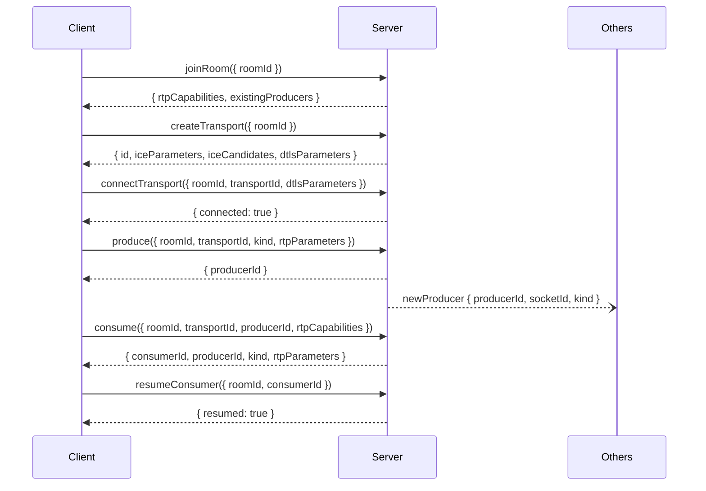

# Mediasoup — Real-Time Media

SFU-based audio/video via [mediasoup](https://mediasoup.org/) and Socket.IO at the `/mediasoup` namespace.

---

## Architecture

Each client holds **one uplink** to the server. The SFU forwards media to subscribers — no peer-to-peer mesh required.

```
Worker → Router (per room) → WebRtcTransport (×2 per peer)
                                  ├── Producer  (outbound track)
                                  └── Consumer  (inbound track)
```

| Class | Role |
|---|---|
| `MediasoupGateway` | Socket.IO gateway — routes all client messages |
| `RoomService` | Manages rooms, peers, transports, producers, consumers |
| `MediasoupService` | Owns the mediasoup Worker pool, creates Routers |

---

## Supported Codecs

| Kind | Codec | PT |
|---|---|---|
| Audio | Opus 48 kHz stereo | 96 |
| Video | VP8 | 100 |
| Video | H.264 Baseline 3.1 | 101 |

---

## Client Integration

### Connect

```ts
const socket = io('https://your-backend.com/mediasoup', { transports: ['websocket'] });
```

### Flow (6 steps in order)



#### 1 — Join

```ts
const { rtpCapabilities, existingProducers } = await socket.emitWithAck('joinRoom', { roomId });
await device.load({ routerRtpCapabilities: rtpCapabilities });
```

#### 2 — Create transports (×2)

```ts
const sendOpts = await socket.emitWithAck('createTransport', { roomId });
const recvOpts = await socket.emitWithAck('createTransport', { roomId });

const sendTransport = device.createSendTransport(sendOpts);
const recvTransport = device.createRecvTransport(recvOpts);
```

#### 3 — Connect transports

Wire the `connect` event on both transports:

```ts
sendTransport.on('connect', async ({ dtlsParameters }, callback, errback) => {
  await socket.emitWithAck('connectTransport', { roomId, transportId: sendTransport.id, dtlsParameters })
    .then(callback).catch(errback);
});
// same pattern for recvTransport
```

#### 4 — Produce

```ts
sendTransport.on('produce', async ({ kind, rtpParameters }, callback, errback) => {
  const { producerId } = await socket.emitWithAck('produce', { roomId, transportId: sendTransport.id, kind, rtpParameters });
  callback({ id: producerId });
});

const stream = await navigator.mediaDevices.getUserMedia({ video: true, audio: true });
await sendTransport.produce({ track: stream.getVideoTracks()[0] });
await sendTransport.produce({ track: stream.getAudioTracks()[0] });
```

#### 5 — Consume

```ts
async function consume(producerId: string) {
  const params = await socket.emitWithAck('consume', {
    roomId, transportId: recvTransport.id, producerId, rtpCapabilities: device.rtpCapabilities,
  });
  const consumer = await recvTransport.consume(params);
  videoEl.srcObject = new MediaStream([consumer.track]);
  await socket.emitWithAck('resumeConsumer', { roomId, consumerId: params.consumerId });
}
```

> Consumers start **paused** — `resumeConsumer` must be called before media flows.

#### 6 — Consume existing producers (late join)

After connecting transports, consume anyone already in the room:

```ts
for (const { producerId } of existingProducers) await consume(producerId);
```

---

## Server-Pushed Events

| Event | When | Payload |
|---|---|---|
| `newProducer` | A peer starts producing | `{ producerId, socketId, kind }` |
| `peerLeft` | A peer disconnects | `{ socketId }` |

```ts
socket.on('newProducer', ({ producerId }) => consume(producerId));
socket.on('peerLeft', ({ socketId }) => removeVideoElement(socketId));
```

---

## Disconnect & Cleanup

Closing the socket is sufficient. The server automatically closes all transports/producers/consumers for that peer, notifies remaining peers via `peerLeft`, and destroys the room when it becomes empty.

---

## Environment Variables

| Variable | Default | Description |
|---|---|---|
| `NODE_ENV` | `development` | `production` enables DNS-based IP resolution |
| `ANNOUNCED_DOMAIN` | `yourdomain.com` | Public hostname resolved for the announced IP |

Development always uses `127.0.0.1`. In production, set `ANNOUNCED_DOMAIN` to your server's hostname.

---

## Common Errors

| Error | Cause |
|---|---|
| `Room <id> not found` | Acting on a room before `joinRoom` |
| `Peer not found` | Socket not registered in the room |
| `Transport <id> not found` | Invalid or closed transport ID |
| `Peer cannot consume producer <id>` | Codec incompatibility |
| `Consumer <id> not found` | Invalid consumer ID |

